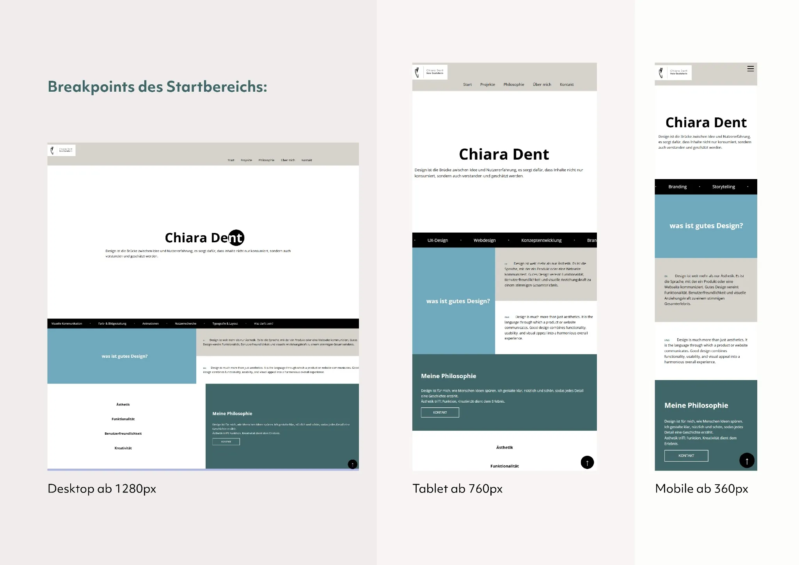
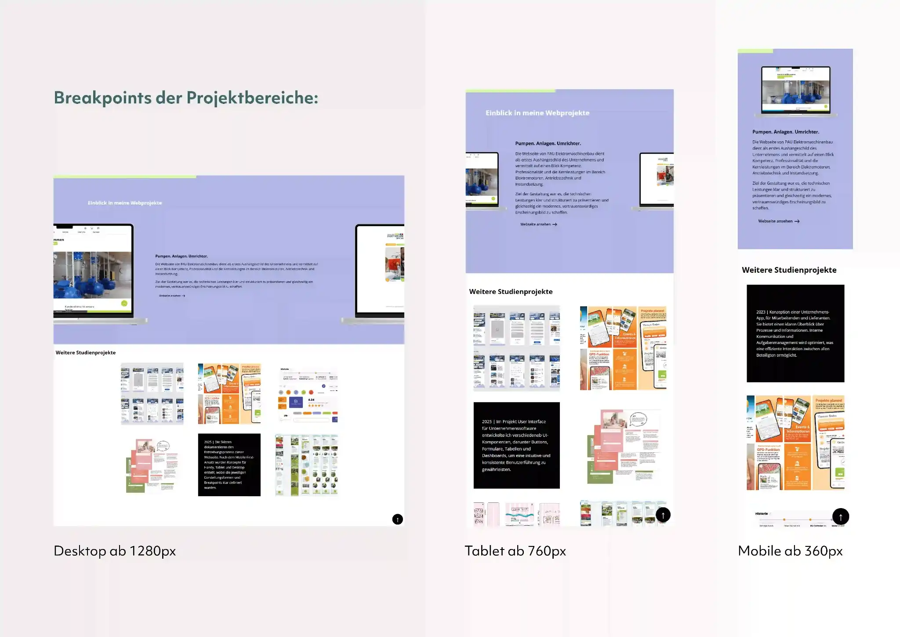
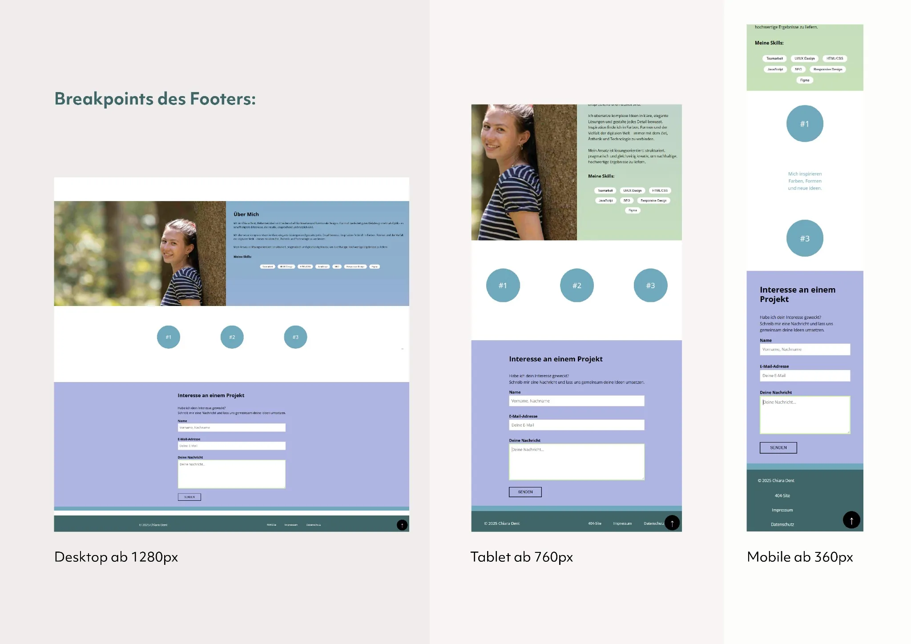

# Portfolio Projekt – Web-Programmierung (DLBUXPWP01)

Ein modernes, responsives Web-Portfolio, zur Präsentation meiner Projekte, technischen Fähigkeiten und Dienstleistungen in einem professionellen, künstlerischen Design.


## 📌 Auf einen Klick

Besuche die **Live-Webseite** und teste das Projekt direkt:

[🌐 Live-Demo ansehen](https://iu-webprogrammierung.github.io/webprogrammierung-kiki-d/)

## 💡 Projektübersicht

Das Web-Portfolio wurde im Rahmen des Studiums im Kurs 'Projekt: Web-Programmierung' erstellt und zeigt meine persönliche Berufslaufbahn im Bereich Webdesign und Gestaltung von Kommunikationsmedien. Die Webseite wurde responsiv und modular aufgebaut und erfüllt die aktuellen Vorgaben der Barrierefreiheit.  

### Besonderheiten:
- Saubere Navigationsstruktur (Header, Nav, Footer)
- Leserfreundliche Texte mit klaren Hierarchien (H1, H2, H3, p)
- Strukturierte CSS-Datei mit klaren Section & Überschriften (SCSS Strukturen)
- Barrierefreier und SEO-optimierter Code: semantische HTML-Struktur, alt-Attribute, ARIA-Attribute
- Kontakt-Formular mit Labels und Validierung
- Einsatz reduzierte AVIF-Bilder
- Verspielte 404-Seite 

### Animationen:
- Animierter Cursor im Hero-Bereich, der die Mausbewegung interpolliert
- Horizontal laufender Endlos-Textstreifen
- Bunt verspielte Mausover-Button
- Horizontaler Projektabschnitt mit fixiertem Fortschrittsbalken
- Projektgrid mit Mouseover-Text und unterschiedlichen Links für Desktop und Mobil
- Animierter Farbverlauf-Hintergrund


Die Webseite kombiniert sauberen, SEO-optimierten Code und interaktive Animationen zu einem modernen Web-Erlebnis.


## 🔧 Technologie-Stack

- **Frontend:** HTML 5, CSS3, SCSS, JavaScript

- **Design:** Figma, Adobe Photoshop

- **Tools:** VS Code, Git/GitHub


## 💻 Responsive Design Strategie

Durch den Einsatz von Media Queries ist die Webseite responsiv für Desktop, Tablet und Mobile optimiert:

- Mobilgeräte (360px - 759px)
- Tablet (760px - 1279px)
- Desktop (1280px - 1920px)


## 🌟 Code-Snippets 

### seitliche Scrollfunktion des Projektbereichs (JS)
```html
const section = document.querySelector('#projects');
const list = section.querySelector('.projects-list');

function updateHorizontalScroll() {
  const rect = section.getBoundingClientRect();
  const scrollWidth = list.scrollWidth - window.innerWidth;

  // Fortschritt des Scrollens (0–1)
  const progress = Math.min(Math.max(-rect.top / scrollWidth, 0), 1);

  // Horizontal verschieben
  list.style.transform = `translateX(-${progress * scrollWidth}px)`;
}

window.addEventListener('scroll', updateHorizontalScroll);
window.addEventListener('resize', updateHorizontalScroll);
updateHorizontalScroll();
```
Der Code zeigt einer vereinfachte Version des **horizontalen Scroll-Effekts**. Die vertikale Scrollposition wird dabei in eine horizontale Bewegung umgerechnet. Für den gesamten Code siehe loader.js


### "Scroll-to-Top"-Effekt (JS)

```html
const scrollButton = document.querySelector('.scroll-button');

scrollButton.addEventListener('click', function(e) {
  e.preventDefault(); 

  const scrollDuration = 800; 
  const scrollStep = -window.scrollY / (scrollDuration / 15);

  const scrollInterval = setInterval(function() {
    if (window.scrollY !== 0) {
      window.scrollBy(0, scrollStep);
    } else {
      clearInterval(scrollInterval);
    }
  }, 15);
});
```
Der Code sorgt dafür, dass beim Klick auf die .scroll-button-Schaltfläche **die Seite sanft nach oben scrollt**, anstatt sofort zum Seitenanfange zu springen.


## 🗂️ Projektstruktur

| Bereich                       | Effekte                                                                     |
|-------------------------------|-----------------------------------------------------------------------------|
| Hero                          | Sanfter, gleitender Cursor im Hero-Bereich                                  |
| Philosopie                    | Layout optimiert für Desktop, Tablet und Mobile mittels Media Queries       |
| Projekte                      | Projekte scrollen horizontal mit fixiertem Fortschrittsbalken               |
| weitere Projekte              | Mouseover-Text und unterschiedliche Links für Desktop und Mobile            |
| Über Mich                     | Animierter Farbverlauf-Hintergrund, gepolsterte Artikel                     |
| Kontakt                       | Sanftes Scrollen nach oben beim Klick auf die Scroll-Button-Schaltfläche    |

  

## 🔍 Screenshots

 
Ansichten des Startbereichs

 
Ansichten der Projektbereiche

 
Ansichten des Footers

## 📈 Geplante Verbesserungen

- durchgehende Aktualisierungen von weiteren Projekten
- optisches Feintuning
- Erfolgreiches Senden des Kontaktformulars


## Projektrückblick

### was habe ich gelernt?

- **Entwicklungsumgebung**: Visual Studio Code
- **Struktur**: Klare Sections und Überschriften für komplexe Inhalte
- **CSS-Techniken**: SCSS, Media Queries und moderne Styles
- **Interaktivität**: Cursor-, Scroll- und Hover-Animationen
- **Qualität**: SEO-optimierter und barrierefreundlicher Code
- **Versionierung**: Git für Versionskontrolle


Durch das Projekt habe ich meine Kenntnisse in HTML, CSS/SCSS und JavaScript vertieft, interaktive Elemente wie Maus- und Scroll-Animationen umgesetzt und gelernt, sauberen, wartbaren Code zu schreiben. Dabei wurde mir bewusst, wie wichtig Barrierefreiheit, Performance und klare Strukturen für Webseiten sind.

###

## 📞 Kontakt

- E-Mail: chiara.dent@t-online.de


---

© 2025 Chiara Dent. Alle Rechte vorbehalten.
